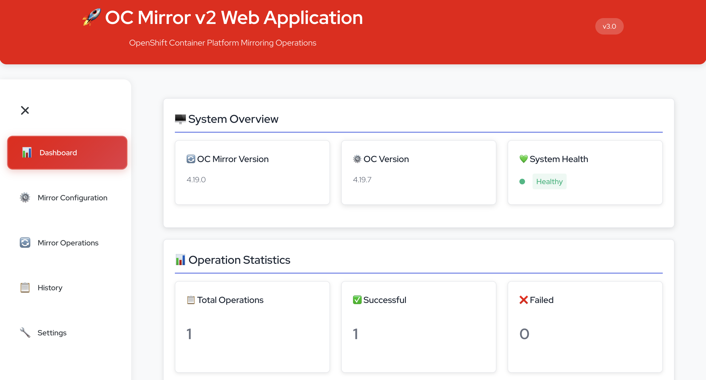
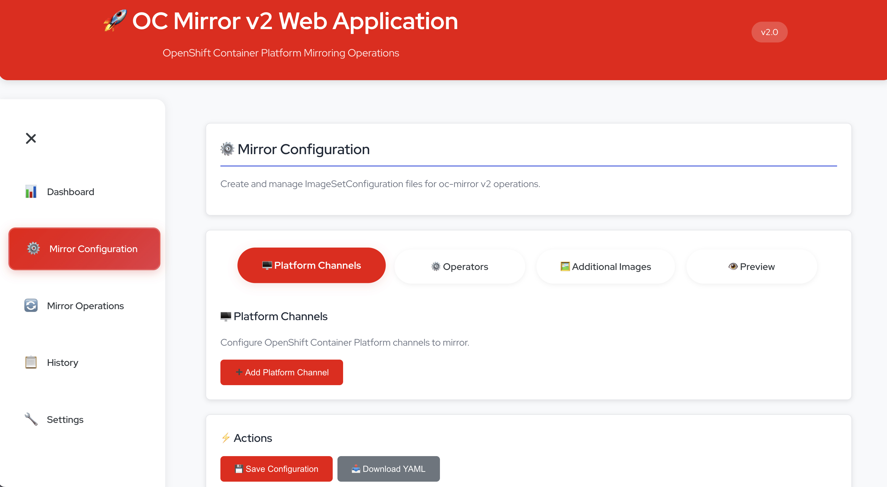
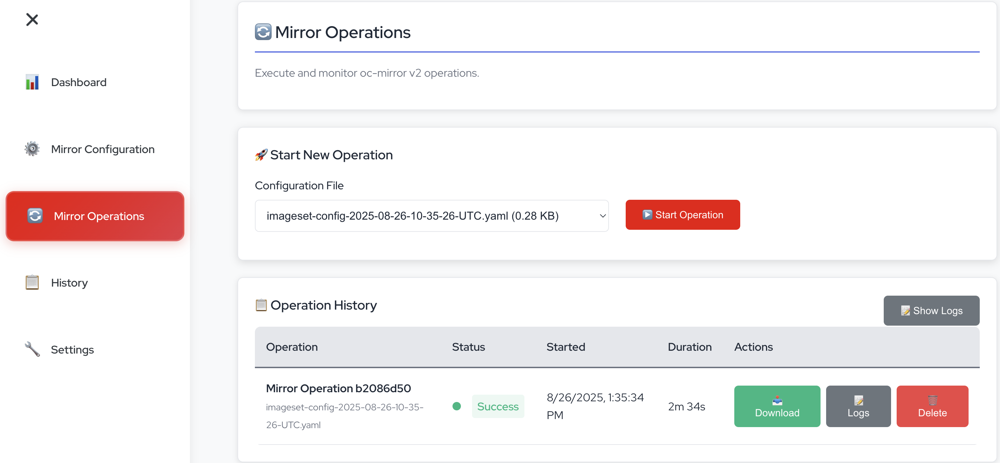

# OC Mirror v2 Web Application

A modern web-based interface for managing OpenShift Container Platform mirroring operations using oc-mirror v2. This application provides a user-friendly way to create, manage, and execute mirror configurations without requiring command-line expertise.

**Current Version: v3.1.3**

## 📋 Table of Contents

### 🚀 Getting Started
- [Quick Start (Containerized)](#-quick-start-containerized---no-host-dependencies)
  - [Prerequisites](#prerequisites)
  - [Clone and Navigate](#1-clone-and-navigate)
  - [Run with Container Script](#2-run-with-container-script-recommended)
  - [Access the Application](#3-access-the-application)
  - [Container Management](#container-management)
  - [Operator Catalog Fetching](#operator-catalog-fetching)

### 🔧 Alternative Deployment Options
- [Quay.io Images (quay-run.sh)](#alternative-quayio-images-quay-runsh)
- [Podman Compose](#alternative-podman-compose)
- [Docker Compose](#alternative-docker-compose)

### 📋 Features & Capabilities
- [Features](#-features)
  - [Core Functionality](#-core-functionality)
  - [Technical Features](#-technical-features)
  - [Security Features](#️-security-features)
- [Application Structure](#-application-structure)
- [Download System](#-download-system)
  - [Dynamic Progress Tracking](#dynamic-progress-tracking)
  - [Download Process](#download-process)
  - [Technical Implementation](#technical-implementation)

### 🔄 Technical Details
- [oc-mirror v2 Support](#-oc-mirror-v2-support)
  - [Supported Features](#-supported-features)
  - [Configuration Format](#-configuration-format)
  - [Configuration Features](#-configuration-features)

### 🎨 User Experience
- [User Interface](#-user-interface)
  - [Dashboard](#dashboard)
  - [Mirror Configuration](#mirror-configuration)
  - [Mirror Operations](#mirror-operations)
  - [History](#history)
  - [Settings](#settings)
- [Screenshots](#-screenshots)
  - [Dashboard](#dashboard-1)
  - [Mirror Configuration](#mirror-configuration-1)
  - [Mirror Operations](#mirror-operations-1)

### 📚 Documentation & Support
- [API Documentation](#-api-documentation)
- [Troubleshooting](#-troubleshooting)
- [Contributing](#-contributing)
- [License](#-license)
- [Support](#-support)

### 🔧 Compatibility & Requirements
- [Version Compatibility](#-version-compatibility)
  - [Supported oc-mirror Versions](#supported-oc-mirror-versions)
  - [Supported OpenShift Versions](#supported-openshift-versions)
  - [Deployment Options](#deployment-options)
  - [Container Runtime Requirements](#container-runtime-requirements)
  - [Architecture Support](#architecture-support)

---

## 🚀 Quick Start (Containerized - No Host Dependencies)

The easiest way to run this application is using containers. This approach requires **no installation** of Node.js, oc, or oc-mirror on your host system.

### Prerequisites

- **Docker** OR **Podman** (choose one!)
- **OpenShift pull-secret.json** (required to connect to Red Hat registries)

> **Note:** You must provide a valid `pull-secret.json` file (downloadable from https://console.redhat.com/openshift/downloads#tool-pull-secret) in order to mirror images from Red Hat registries.

### 1. Clone and Navigate

```bash
cd oc-mirror-web-app
```

### 2. Run with Container Script (Recommended)

> **🚨 IMPORTANT: First Run Requirement** 🚨
> 
> **For your first run, you MUST use the `--fetch-catalogs` flag to download operator catalogs:**
> 
> ```bash
> # Make the script executable
> chmod +x container-run.sh
> 
> # ⭐ FIRST RUN: Build and run with catalog fetching (REQUIRED)
> ./container-run.sh --fetch-catalogs
> ```
> 
> **Why is this important?**
> - The `--fetch-catalogs` flag downloads real operator catalog data for all OCP versions (4.15-4.19)
> - **Without this flag, the application will not work properly** - it requires the catalog data to function
> - This ensures you have access to the complete list of operators and their channels
> - Subsequent runs can use `./container-run.sh` (without the flag) for faster startup

The script automatically detects whether you have Docker or Podman and uses the appropriate one.

The script will:
- ✅ Detect your container runtime (Docker or Podman)
- ✅ Check container runtime availability
- ✅ Create necessary data directories
- ✅ Build the container image (includes oc and oc-mirror v2)
- ✅ Start the containerized application with optimized settings
- ✅ Display access information

### 3. Access the Application

Once running, access the web interface at:
- **Web UI**: http://localhost:3000
- **API**: http://localhost:3001

### Container Management

```bash
# View logs
./container-run.sh --logs

# Stop the application
./container-run.sh --stop

# Build image only
./container-run.sh --build-only

# Run container only (assumes image exists)
./container-run.sh --run-only

# Check which container engine is detected
./container-run.sh --engine

# Build with catalog fetching (complete data, slower build)
./container-run.sh --fetch-catalogs

# Build without fetching catalogs (fast build, uses fallback data)
./container-run.sh
```

The container now includes:
- **Multi-architecture support** for AMD64 and ARM64
- **Optimized environment variables** for better performance
- **Enhanced logging** with configurable log levels
- **Improved caching** for OC Mirror operations
- **Better error handling** and health checks
- **Pre-fetched operator catalogs** for OCP versions 4.15-4.19 (faster operator selection)
- **Multi-format catalog processing** for complete operator coverage
- **Automatic architecture detection** and display in system status

### Operator Catalog Fetching

The application now pre-fetches operator catalogs for all supported OCP versions (4.15-4.19) during the build process. This provides:

- **Faster operator selection** - No need to query catalogs at runtime
- **Version-specific channels** - Each OCP version has its own operator catalog
- **Offline capability** - Works without internet access after build
- **Accurate channel information** - Real catalog data instead of static fallbacks
- **Enhanced compatibility** - Supports multiple catalog formats including index.yaml

**Build Options:**
- **Default (Fast)**: No catalog fetch (uses fallback data, builds in 2-3 minutes)
- **Complete build**: Use `--fetch-catalogs` flag (takes 5-10 minutes, provides complete data)

**Supported Catalogs:**
- Red Hat Operator Index
- Certified Operator Index  
- Community Operator Index

**Catalog Processing:**
- **Multi-format support**: Handles catalog.json, index.json, index.yaml, package.json, and YAML formats
- **Robust extraction**: Gracefully handles non-standard operator structures
- **Complete coverage**: Processes all operators including edge cases like lightspeed-operator

### Alternative: Quay.io Images (quay-run.sh)

For production deployments using pre-built images from Quay.io:

```bash
# Make the script executable
chmod +x quay-run.sh

# Start the application from Quay.io
./quay-run.sh

# View logs
./quay-run.sh --logs

# Stop the application
./quay-run.sh --stop

# Show status
./quay-run.sh --status

# Restart the application
./quay-run.sh --restart
```

### Alternative: Podman Compose

If you prefer using compose with Podman:

```bash
# Make the script executable
chmod +x podman-compose.sh

# Start with podman-compose
./podman-compose.sh

# View logs
./podman-compose.sh logs

# Stop services
./podman-compose.sh down

# Show status
./podman-compose.sh status
```

### Alternative: Docker Compose

```bash
# Start with docker-compose
docker-compose up -d

# View logs
docker-compose logs -f

# Stop
docker-compose down
```

[⬆️ Back to Top](#-table-of-contents)


## 📋 Features

### 🎯 Core Functionality
- **Configuration Management**: Create, edit, and manage mirror configurations
- **Operation Execution**: Run mirror operations with real-time monitoring
- **History Tracking**: View and analyze past operations
- **Log Management**: Centralized logging with search and filtering
- **Settings Management**: Configure application preferences
- **Multi-Architecture Support**: Automatic detection and support for AMD64 and ARM64
- **Enhanced Catalog Processing**: Multi-format support for all operator catalog types
- **Dynamic Download Progress**: Real-time progress bar for archive downloads with automatic modal management

### 🔧 Technical Features
- **Real-time Updates**: Live status updates during operations
- **File Management**: Upload, download, and manage configuration files
- **Error Handling**: Comprehensive error reporting and recovery
- **Responsive Design**: Works on desktop and mobile devices
- **RESTful API**: Full API for integration with other tools
- **Dynamic Operator Discovery**: Real-time query of operator catalogs
- **Smart Operator Selection**: Dropdown lists with dynamic operator packages and channels
- **Multi-Format Catalog Support**: Handles catalog.json, index.json, index.yaml, package.json, and YAML formats
- **Advanced Download System**: Polling-based progress tracking with robust error handling and automatic cleanup

### 🛡️ Security Features
- **Input Validation**: Comprehensive validation of all inputs
- **File Sanitization**: Secure file handling and processing
- **Error Isolation**: Operations are isolated to prevent system impact

[⬆️ Back to Top](#-table-of-contents)

## 📁 Application Structure

```
oc-mirror-web-app/
├── src/                    # React frontend
│   ├── components/         # UI components
│   └── App.js             # Main application
├── server/                # Node.js backend
│   └── index.js           # API server
├── data/                  # Persistent data (created automatically)
│   ├── configs/           # Mirror configurations
│   ├── operations/        # Operation history
│   ├── logs/             # Application logs
│   └── cache/            # oc-mirror v2 cache
├── examples/              # Configuration examples
├── Dockerfile            # Container definition
├── docker-compose.yml    # Multi-service setup
├── container-run.sh      # Easy container runner (Docker/Podman)
├── quay-run.sh           # Quay.io image runner
├── podman-compose.sh     # Podman-specific compose runner
└── README.md             # This file
```

[⬆️ Back to Top](#-table-of-contents)

## 📥 Download System

### Dynamic Progress Tracking
The application features an advanced download system with real-time progress tracking:

- **Real-time Progress Bar**: Visual progress indicator showing archive creation progress (0% → 95%)
- **Smart Modal Management**: Progress modal automatically closes when archive creation completes
- **Polling-based Updates**: Robust progress tracking using polling instead of SSE for better reliability
- **Error Recovery**: Graceful handling of download failures and network issues
- **Success Notifications**: Clear user feedback when downloads are ready

### Download Process
1. **Archive Creation**: System creates a compressed archive of operation files
2. **Progress Tracking**: Real-time progress updates via polling
3. **Modal Closure**: Progress modal closes at 95% completion
4. **Browser Download**: Archive automatically starts downloading in the browser
5. **Success Notification**: User receives confirmation of successful download

### Technical Implementation
- **Backend**: Uses `child_process.spawn` with `tar` for efficient archive creation
- **Frontend**: Polling-based progress updates with comprehensive error handling
- **Progress Storage**: Global progress tracking with automatic cleanup
- **Modal Management**: Multiple exit conditions ensure proper modal closure

[⬆️ Back to Top](#-table-of-contents)

## 🔄 oc-mirror v2 Support

This application is specifically designed for **oc-mirror v2**.

### ✅ Supported Features
- **Cache-based Storage**: Uses local cache for efficient operations
- **Improved Performance**: Faster mirroring operations
- **Better Error Handling**: Enhanced error reporting and recovery
- **Simplified Configuration**: Streamlined configuration format

### 📋 Configuration Format

The application generates clean oc-mirror v2 configurations:

```yaml
kind: ImageSetConfiguration
apiVersion: mirror.openshift.io/v2alpha1
mirror:
  platform:
    channels:
    - name: stable-4.18
      minVersion: "4.18.0"
      maxVersion: "4.18.10"
      shortestPath: true
    graph: true
  operators:
  - catalog: registry.redhat.io/redhat/redhat-operator-index:v4.18
    packages:
    - name: advanced-cluster-management
      channels:
      - name: release-2.8
        minVersion: "2.8.0"
        maxVersion: "2.8.0"
  additionalImages:
  - name: registry.redhat.io/ubi8/ubi:latest
```

### 📝 Configuration Features
- ✅ **Cache-based Storage**: Local cache for efficient operations
- ✅ **Direct Package Configuration**: Streamlined operator configuration
- ✅ **Enhanced Validation**: Better validation and error handling
- ✅ **Simplified Format**: Clean and readable configuration structure

[⬆️ Back to Top](#-table-of-contents)

## 🎨 User Interface

### Dashboard
- System status overview
- Recent operations
- Quick action buttons
- Resource usage statistics

### Mirror Configuration
- Visual configuration builder
- Template-based creation
- Import/export functionality
- Validation and preview

### Mirror Operations
- One-click operation execution
- Real-time progress monitoring
- Log streaming
- Operation cancellation
- **Dynamic Download Progress**: Real-time progress bar for archive creation and download
- **Smart Modal Management**: Automatic modal closure with success notifications
- **Robust Error Handling**: Graceful handling of download failures and edge cases

### History
- Comprehensive operation history
- Filtering and search
- Detailed operation analysis

### Settings
- Application configuration
- Registry credentials
- System preferences
- Maintenance tools

[⬆️ Back to Top](#-table-of-contents)

## 📸 Screenshots

### Dashboard


### Mirror Configuration


### Mirror Operations


[⬆️ Back to Top](#-table-of-contents)

## 📚 API Documentation

The application provides a comprehensive RESTful API at `http://localhost:3001/api/`. For detailed API documentation including all endpoints, request/response formats, and examples, see [API.md](API.md).

**Key Endpoints:**
- `GET /api/system/info` - System health check and information (includes architecture detection)
- `GET /api/stats` - Application statistics
- `GET /api/config/list` - List configurations
- `POST /api/config/save` - Create/save configuration
- `GET /api/operations` - List operations
- `POST /api/operations/start` - Start operation
- `GET /api/operations/:id/download` - Download operation archive
- `GET /api/operations/:id/download-progress` - Get download progress (polling endpoint)
- `GET /api/catalogs` - Get available operator catalogs
- `GET /api/operators` - Get available operators (dynamic discovery)
- `GET /api/operator-channels/:operator` - Get channels for specific operator (dynamic)

[⬆️ Back to Top](#-table-of-contents)

## 🤝 Contributing

1. Fork the repository
2. Create a feature branch
3. Make your changes
4. Test thoroughly
5. Submit a pull request

[⬆️ Back to Top](#-table-of-contents)

## 📄 License

This project is licensed under the MIT License - see the LICENSE file for details.

[⬆️ Back to Top](#-table-of-contents)

## 🔧 Troubleshooting

### Configuration Saving Issues

**Problem**: Popup shows "Failed to save configuration"

**Solution**: This is typically a directory permission issue. The container needs write access to the data directories.

```bash
# Fix directory permissions (recommended)
sudo chmod -R 755 data/

# Alternative: Make directories world-writable (less secure)
sudo chmod -R 777 data/
```

**Why this happens**: The container runs as the `nodejs` user (UID 1001), but the data directories might be owned by `root` or have insufficient permissions.

**Verification**: After fixing permissions, try saving a configuration again. The popup should show "Configuration saved successfully".

### Other Common Issues

For additional troubleshooting steps, see the [Troubleshooting section in QUICKSTART.md](QUICKSTART.md#-troubleshooting).

[⬆️ Back to Top](#-table-of-contents)

## 🆘 Support

For issues and questions:
1. Check the troubleshooting section in QUICKSTART.md
2. Review the application logs
3. Open an issue on GitHub

[⬆️ Back to Top](#-table-of-contents)

## 🔧 Version Compatibility

### Supported oc-mirror Versions
- **oc-mirror v2.x**: ✅ Fully supported

### Supported OpenShift Versions
- **OCP 4.15**: ✅ Supported
- **OCP 4.16**: ✅ Supported  
- **OCP 4.17**: ✅ Supported
- **OCP 4.18**: ✅ Supported
- **OCP 4.19**: ✅ Supported

### Deployment Options
- **Local Build**: `./container-run.sh` - Build and run locally
- **Quay.io Images**: `./quay-run.sh` - Use pre-built images from Quay.io
- **Docker Compose**: `docker-compose up -d` - Multi-service deployment
- **Podman Compose**: `./podman-compose.sh` - Podman-specific compose

### Container Runtime Requirements
- **Docker**: 20.10+ ✅ Supported
- **Podman**: 4.0+ ✅ Supported
- **Node.js**: 18+ (included in container)

### Architecture Support
- **AMD64 (x86_64)**: ✅ Fully supported
- **ARM64 (aarch64)**: ✅ Fully supported

[⬆️ Back to Top](#-table-of-contents) 